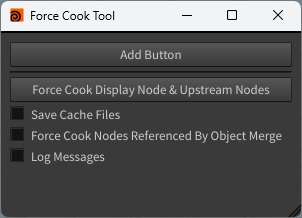
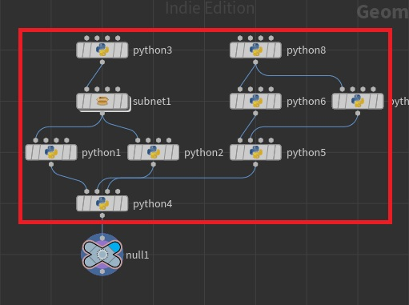
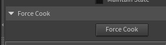

# [Houdini] Force Cook Tool
ノードを強制的に再クックするためのツールです。Pythonノードなど、下流ノードの表示フラグの切り替えだけでは再クックされないノードに対して有効です。

## 動作確認環境
Houdini Indie Limited-Commercial 21.0.440

## 導入方法
本ツールはシェルフツールです。
script.pyの内容を登録してください。
詳細な手順に関しては、過去に作成したツールとほぼ同様ですので、そちらをご覧ください。

[[Houdini] Bezier Curve Tool](https://github.com/iribo0425/bezier_curve_tool?tab=readme-ov-file#%E5%B0%8E%E5%85%A5%E6%96%B9%E6%B3%95)

## 使用方法&GUI説明

| | |
| - | - |
| Force Cook Selected Nodes & Upstream Nodes | 選択中のノードと、そのノードより上流のノードを全て強制クックします。 以下の例では、null1ノードと、null1ノードより上流のpythonノードとsubnetノードの中身を全て強制クックします。  |
| Save Cache Files | 強制クックの際に、File CacheノードのSave to Diskを実行するかを設定します。 |
| Force Cook Nodes Referenced By Object Merge | 強制クックの際に、Object Mergeノードの参照先も強制クックするかを設定します。 |
| Log Messages | デバッグ用。強制クックの際に、ログをコンソールに出力するかを設定します。 |
| Add Button | 選択中のノードに強制クックのボタンを追加します。  |
